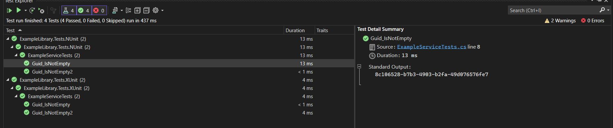
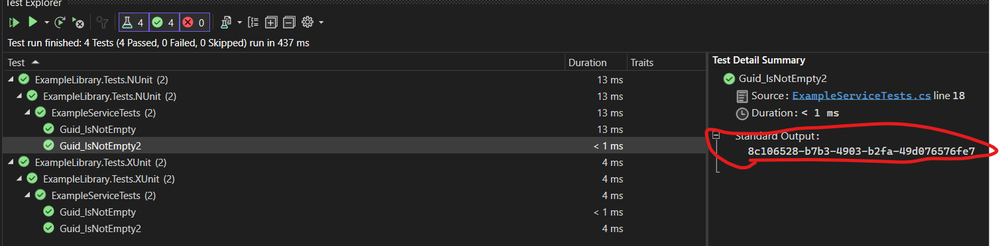
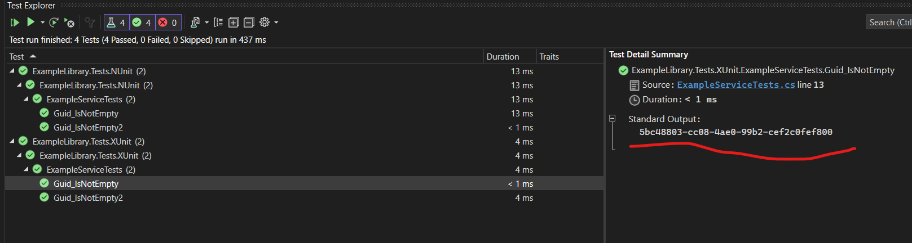
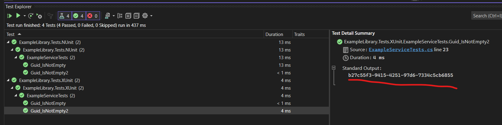

As you can see here, in xUnit, the same `Guid` ID instance is shared by default in the test class, but it's not immediately apparent, which might seem like magic. However, in most cases, we don't need this behavior by default, as it can be confusing and lead to unexpected results in our code.

To illustrate this behavior, here are two screenshots showing the same `Guid` ID:

But as you see here, xUnit does not do that. It creates a new instance for every test method, which is a more modern and expected behavior.

Here are screenshots from xUnit tests, showcasing its behavior of creating a new Guid instance every time. In contrast, NUnit shares the same instance, which can lead to undesirable outcomes.

# NUnitVsXUnit
